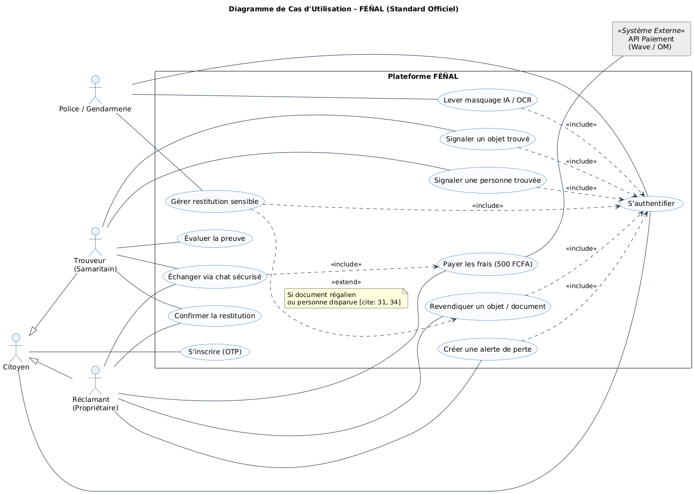
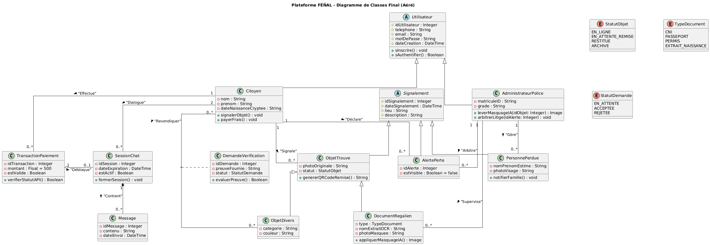
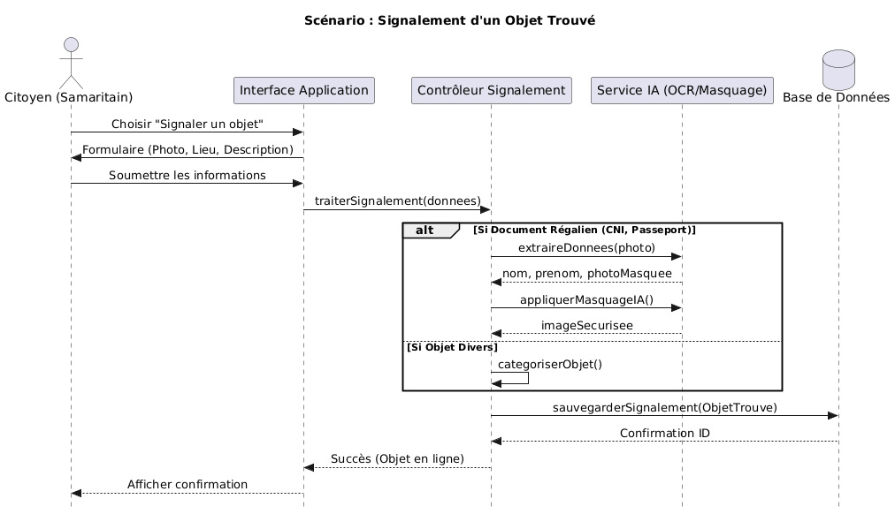
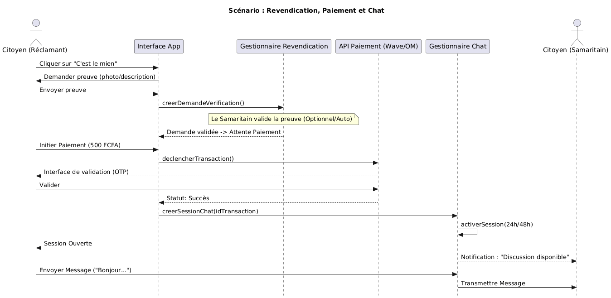
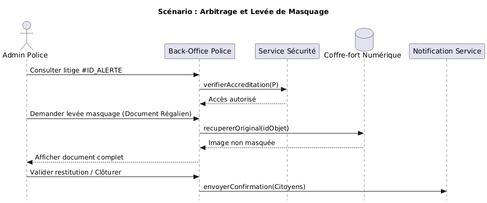
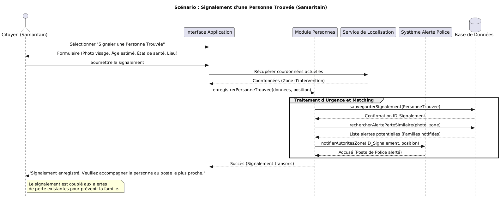
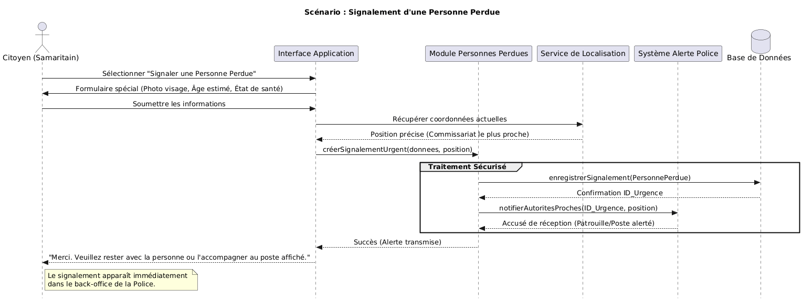
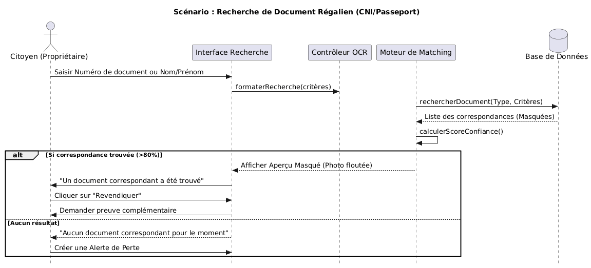
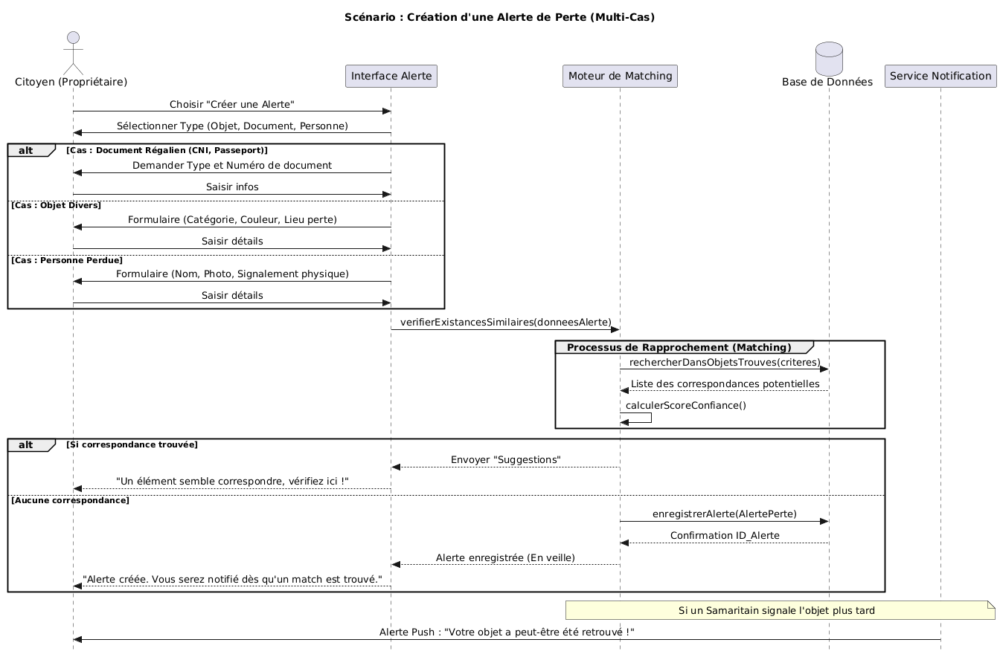

				FÉÑAL 

1 Introduction 

1.1 Présentation générale du produit logiciel 

FÉÑAL est une application citoyenne intelligente de type Peer-to-Peer (P2P) conçue pour le Sénégal. Le client final de ce système est double : d'une part, la population sénégalaise qui perd ou trouve des biens et des personnes, et d'autre part, les autorités régaliennes (Police, Gendarmerie) qui supervisent les éléments critiques. L'objectif global du système est de numériser, sécuriser et faciliter la restitution d'objets perdus (documents, bagages) et le signalement de personnes disparues, en utilisant l'intelligence artificielle pour protéger les données privées.

1.2 Définitions, acronymes, abréviations et conventions 

P2P (Peer-to-Peer) : Modèle de mise en relation directe entre deux citoyens (le Samaritain et le Propriétaire).

Samaritain : Le citoyen "Trouveur" qui signale un objet ou une personne sur la plateforme.

OCR (Optical Character Recognition) : Technologie d'IA utilisée pour extraire le texte des documents numérisés.

CDP : Commission des Données Personnelles du Sénégal, régissant la protection des données.

AES-256 : Standard de chiffrement cryptographique avancé utilisé pour sécuriser les données en base.

1.3 Documents de référence 

Cahier des charges de l'application FÉÑAL (V1.3).

Loi sur la protection des données à caractère personnel du Sénégal (CDP).

2 Description générale du produit 

2.1 Vue d'ensemble des fonctionnalités du produit

Les requis fonctionnels du système sont divisés en plusieurs catégories clés qui structurent le parcours utilisateur :

Gestion des Utilisateurs : Inscription sécurisée incluant une vérification unique de l'identité par code OTP (numéro de téléphone), suivie d'une authentification standard (identifiant et mot de passe) pour les connexions courantes. Le système assure la gestion sécurisée des profils cryptés.

Gestion des Annonces (IA et Anonymat) : Publication d'objets trouvés ou de personnes sous couvert d'un anonymat strict. L'identité du « Samaritain » (Trouveur) est masquée pour les autres utilisateurs publics ainsi que pour les administrateurs techniques de la plateforme. L'Intelligence Artificielle se charge de l'extraction des données textuelles via OCR et du masquage automatique des zones sensibles sur les photos.

Gestion des Alertes de Perte : Possibilité pour un utilisateur de déclarer proactivement la perte d'un bien en renseignant un formulaire détaillé incluant la date de la perte, le lieu estimé, et les caractéristiques précises de l'élément perdu.

Système de Matching et de Suggestion : Le cœur intelligent de la plateforme, divisé en logiques métiers distinctes selon la nature de l'élément :

Pour les Documents Régaliens (CNI, Passeport, etc.) : Le matching est déterministe et strict. L'algorithme ne suggère le document au propriétaire que si l'OCR valide une correspondance exacte sur quatre critères fondamentaux : le Prénom, le Nom, le Lieu de naissance et l'Adresse.

Pour les Objets Ordinaires : Le système opère par suggestion ciblée. L'algorithme propose une liste d'objets trouvés en filtrant rigoureusement selon le Type, la Couleur et le Lieu. Règle chronologique : Le système exclut automatiquement tout objet dont la date de découverte publiée est antérieure à la date de perte déclarée.

Pour les Personnes Perdues (Sécurité Critique et Double Aveugle) : Pour prévenir tout risque de harcèlement ou d'enlèvement, le matching repose sur un protocole d'escalade aux autorités. Le système croise les alertes de disparition avec les signalements de personnes trouvées via des métadonnées strictes (Tranche d'âge, Sexe, Zone géographique, Vêtements). En cas de correspondance, aucune information de contact ou de géolocalisation n'est partagée entre les citoyens. Le système achemine la correspondance de manière chiffrée vers le tableau de bord de la Police/Gendarmerie, qui se chargera de vérifier légalement la parenté avant toute restitution physique.

Transactions et Communication : Paiement des frais de mise en relation (500 FCFA) via l'intégration d'API de Mobile Money (Wave / Orange Money). Une fois le paiement validé, le système débloque une session de chat privé et sécurisé entre les deux parties pour organiser la restitution.

Administration Régalienne : Interface dédiée et hautement sécurisée (Super-Administrateur) exclusivement réservée aux forces de l'ordre (Police/Gendarmerie). Ce portail permet de lever le masquage IA des documents et de désanonymiser l'auteur d'une publication dans le cadre strict d'une enquête légale.

2.2 Requis non fonctionnels

Sécurité et Confidentialité : Le système applique le principe du moindre privilège. Il doit impérativement chiffrer les informations sensibles en base de données (AES-256). Le système garantit qu'aucun administrateur technique ne peut voir l'identité d'un publieur ; ce privilège est techniquement verrouillé et strictement réservé aux comptes régaliens. Enfin, les adresses exactes des Samaritains ne sont jamais affichées publiquement.

Performance : Le traitement de l'image (OCR et masquage) doit s'effectuer en moins de 5 secondes pour garantir une bonne expérience utilisateur.

Disponibilité : L'application doit être hautement disponible, notamment pour le volet critique des alertes de personnes disparues qui nécessite une surveillance en temps réel (24h/24 et 7j/7).

2.3 Hypothèses 

On suppose que les utilisateurs disposent d'un smartphone avec une connexion Internet (3G/4G) fonctionnelle pour utiliser l'application.

On suppose que les API des opérateurs de paiement mobile (Wave, Orange Money) sont stables et disponibles.

On suppose que les citoyens utilisent des numéros de téléphone légalement identifiés au Sénégal (requis pour l'OTP).

3 Description détaillée 

3.1 Modèle environnemental 

3.1.1 Diagramme de cas d'utilisation 

Le système interagit principalement avec trois acteurs : le Samaritain (Trouveur), le Propriétaire, et l'Administrateur (Police/Gendarmerie). Les processus complets d'utilisation de haut-niveau sont restreints à l'essentiel.

1. Cas d'Utilisation : S'inscrire & S'authentifier

Acteur principal : Citoyen (Samaritain ou Réclamant).

Objectif : Garantir une identité unique et sécurisée pour chaque utilisateur.

Scénario Nominal :

L'utilisateur saisit son numéro de téléphone.

Le système envoie un code OTP par SMS.

L'utilisateur valide son identité avec le code et définit un mot de passe.

Le système crée un profil crypté (AES-256).

Scénario Alternatif : Si le numéro n'est pas identifié légalement au Sénégal, l'accès est refusé.

2. Cas d'Utilisation : Signaler un objet trouvé

Acteur principal : Samaritain.

Objectif : Publier une annonce anonymisée.

Scénario Nominal :

Le Samaritain s'authentifie.

Il photographie l'objet et renseigne le lieu/date.

L'IA (OCR) extrait les textes des documents et masque les zones sensibles (visages, adresses) sur la photo publique.

L'annonce est publiée sous un anonymat strict.

3. Cas d'Utilisation : Créer une alerte de perte (Invisible) & Matching

Acteur principal : Réclamant.

Objectif : Déclarer un bien perdu sans exposition publique.

Scénario de Confidentialité :

Le Réclamant crée une alerte (type, couleur, lieu, date).

Pour un document, il saisit les données (Nom, Prénom, Date/Lieu de naissance, Numéro partiel).

L'alerte reste totalement invisible pour les autres utilisateurs.

Le système effectue un matching en arrière-plan et envoie une suggestion si une correspondance est trouvée.

4. Cas d'Utilisation : Revendiquer & Évaluer la preuve

Acteurs : Réclamant, Samaritain.

Scénario Objet Simple (Validation Humaine) :

Le Réclamant clique sur "Revendiquer" sur une suggestion et fournit des détails (preuves).

Le Samaritain reçoit la preuve et dispose de deux options : [C'est lui] ou [Ce n'est pas lui].

Si [C'est lui], le processus passe au paiement.

Scénario Document Régalien (Validation Système) :

Le système compare l'OCR du document trouvé avec les données de l'alerte (4 points de concordance).

Si le matching est exact, le système valide automatiquement l'identité. En cas d'homonymie, la Police arbitre.

5. Cas d'Utilisation : Paiement & Ouverture du Chat (P2P)

Acteurs : Réclamant, API de Paiement (Wave/OM).

Scénario Nominal :

Une fois la preuve validée (par le Samaritain ou le Système), le Réclamant doit payer 500 FCFA.

Dès confirmation de l'API, le Chat Sécurisé s'ouvre.

Les deux parties organisent la rencontre.

Après restitution, les deux confirment sur l'application pour clore l'annonce.

6. Cas d'Utilisation : Signaler une personne disparue

Acteurs : Samaritain, Réclamant, Police/Gendarmerie.

Scénario de Sécurité (Double Aveugle) :

Matching entre signalement de trouvé et alerte de disparition.

Aucune mise en relation directe entre citoyens.

Alerte automatique des autorités qui gèrent l'identification et la rencontre.

7. Cas d'Utilisation : Administration Régale & Arbitrage

Acteur principal : Police / Gendarmerie.

Scénario :

Levée du masquage IA pour enquête.

Arbitrage d'identité : En cas d'homonymes parfaits sur un document, la Police déchiffre les données pour désigner le propriétaire légitime.

Désanonymisation sur réquisition judiciaire.

3.2 Diagramme de classe

3.3 Diagramme de séquence

1. Diagramme de Séquence : Signalement d'un objet trouvé

2. Diagramme de Séquence : Revendication et Ouverture du Chat

3. Diagramme de Séquence : Intervention de la Police (Arbitrage)

4. Diagramme de Séquence : Signalement d'une personne trouvé

5. Diagramme de Séquence : Recherche et Identification de Document Régalien

6. Diagramme de Séquence : alerte de perte

